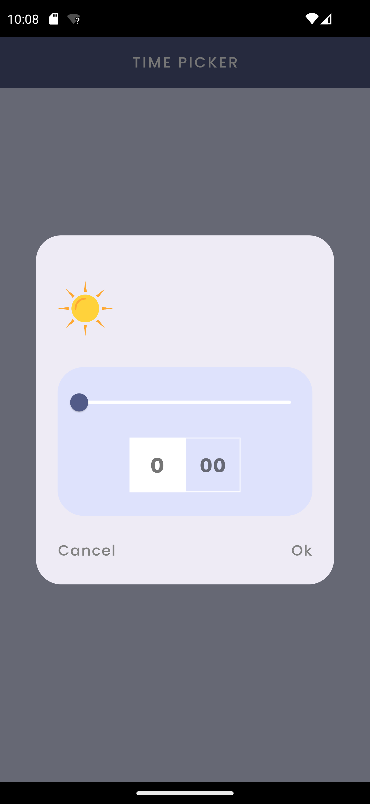
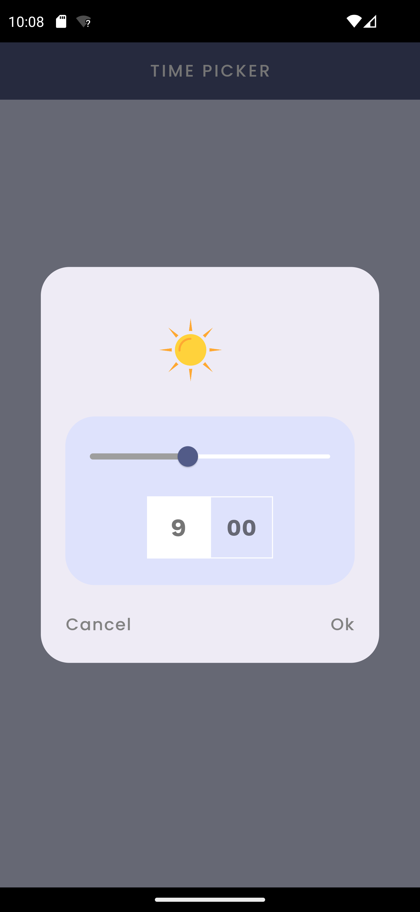
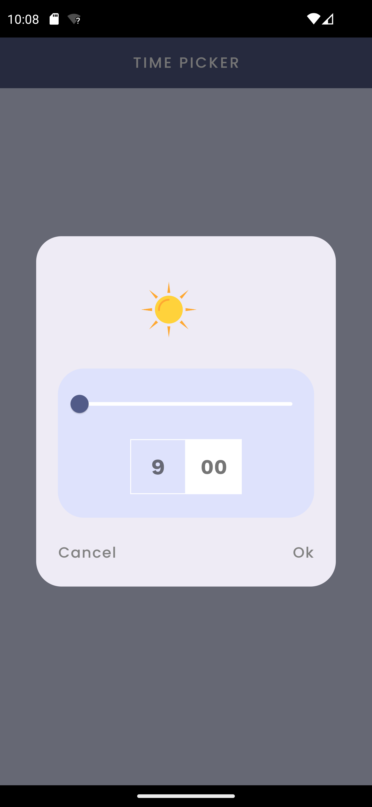
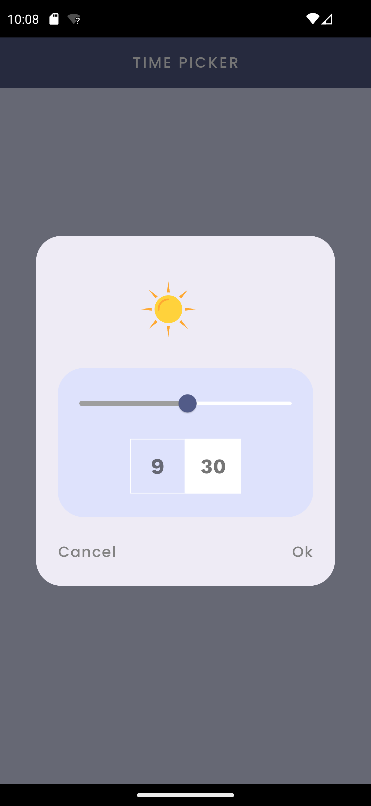
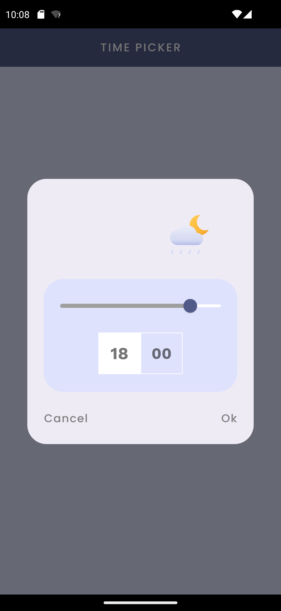
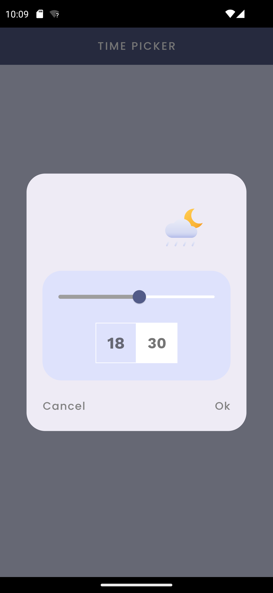

# Time Picker

**Time Picker** is an elegant Flutter application designed to provide users with a seamless and visually appealing experience for selecting time ranges. The app introduces a custom time picker dialog that goes beyond basic functionality, offering real-time updates, interactive features, and a polished user interface.

## Key Features

### 1. Custom Time Picker Dialog

The heart of the application lies in its custom time picker dialog. Carefully crafted to be intuitive and user-friendly, this dialog allows users to effortlessly choose a time range. The thoughtful design ensures a smooth and visually pleasing interaction, enhancing the overall user experience.

### 2. Real-Time Updates

Experience real-time updates as you interact with the time picker dialog. The selected time values dynamically adjust, providing instant feedback and eliminating any guesswork. Users can confidently make decisions based on the current state of their time selection.

### 3. Interactive Interface

Navigating through time slots has never been more engaging. The interactive interface allows users to tap on specific time slots to set the "From" and "To" values with precision. This level of interactivity not only simplifies the selection process but also adds a touch of sophistication to the overall design.

## Screenshots
















## Getting Started

To experience the elegance of the Time Picker app, follow these steps:

1. **Clone the Repository:**

   ```bash
   git clone https://github.com/AbdulRahmanFares/time_picker.git
   ```

2. **Navigate to the Project Directory:**

   ```bash
   cd time_picker
   ```

3. **Open in Flutter IDE:**

   Open the project in your preferred Flutter IDE.

4. **Install Dependencies:**

   ```bash
   flutter pub get
   ```

5. **Run the App:**

   ```bash
   flutter run
   ```

## How to Use

1. **Launch the App:**

   Upon launching the app, you will be greeted with a container featuring two options: "From" and "To". This initial screen serves as the starting point for selecting your desired time range.

2. **Select "From":**

   - Tap on the "From" option within the container to initiate the time selection process.

   - A customized time picker dialog will appear, providing an interactive interface to choose the starting time of your desired range.

   - Use the dialog to precisely set the "From" time according to your requirements.

3. **Select "To":**

   - Similarly, tap on the "To" option within the container to begin selecting the ending time of your range.

   - The same customized time picker dialog will be presented, allowing you to pick the concluding time with ease.

   - Adjust the dialog to accurately set the "To" time based on your preferences.

4. **Real-Time Updates:**

   - Experience real-time updates in the selected time values as you interact with the dialog. The chosen times will dynamically adjust, providing instant feedback.

5. **Confirm or Cancel:**

   - Confirm your selected time range by tapping the "Ok" button within the time picker dialog.

   - Alternatively, if you wish to cancel the selection, use the "Cancel" button to close the dialog without making any changes.

This interactive process ensures a seamless and intuitive way to choose a time range, making use of the customized time picker dialog for both "From" and "To" options.

## Dependencies

This project utilizes the following dependencies to enhance its functionality and aesthetics:

- **google_fonts:** A package for integrating Google Fonts seamlessly into Flutter applications.
- **colorful_safe_area:** A package that adds color to the SafeArea, enhancing the visual appeal of the app.

## Issues and Contributions

We welcome your feedback and contributions to improve the Time Picker app. If you encounter any issues or have suggestions for enhancements, please [open an issue](https://github.com/AbdulRahmanFares/time_picker/issues) or submit a pull request.

## License

Time Picker is licensed under the MIT License. For more details, refer to the [LICENSE](LICENSE) file.

## Support

If you find Time Picker helpful or wish to contribute to its continued development, consider supporting the author with a coffee. Your support is invaluable and appreciated!

[](https://www.buymeacoffee.com/farazzrahman)

